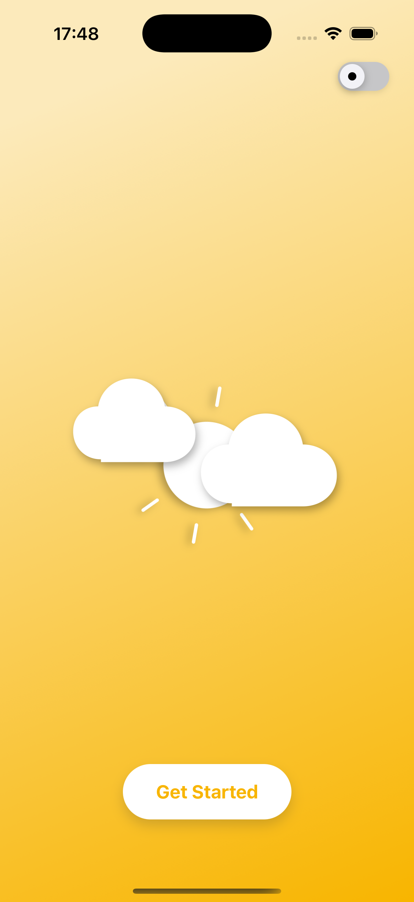
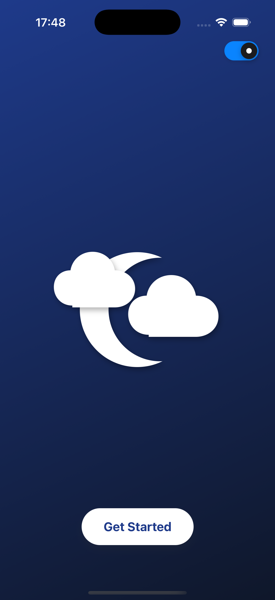
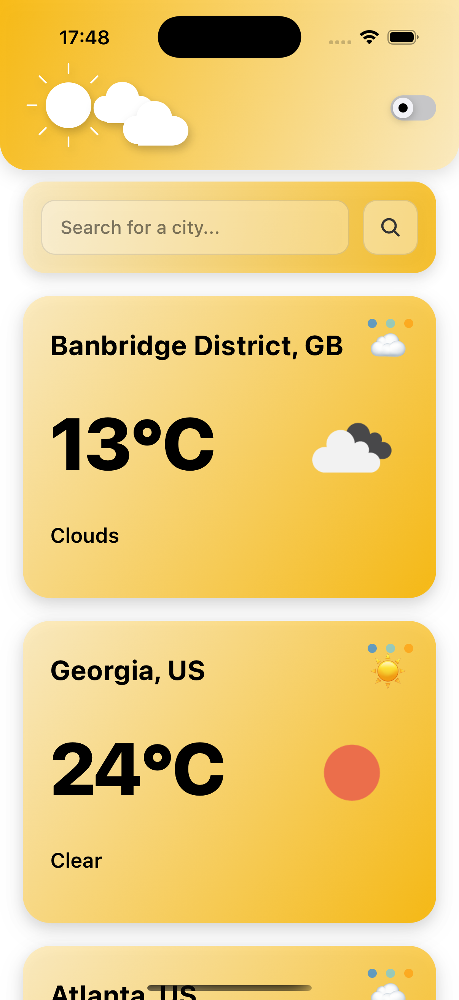
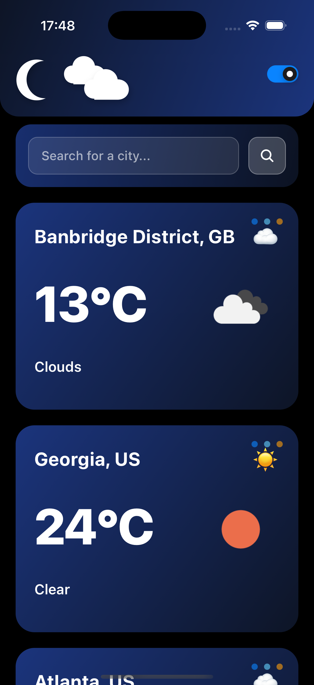

# 🌤️ WeatherApp

A simple React Native weather application built with **Expo**. Stay updated with the latest weather for your current location and your favorite cities! Developed for a technical task for a job interview stage.

---

## 📲 Getting Started

### 📱 Quick Preview (Recommended)
1. Download **Expo Go** on your mobile device:
   - iOS: https://apps.apple.com/app/expo-go/id982107779  
   - Android: https://play.google.com/store/apps/details?id=host.exp.exponent  
2. Open the camera app (ios) or QR scanner (Android) and scan the preview QR code below:
   

---

### 🛠️ Local Setup
1. Clone this repository and install dependencies:
   ```bash
   git clone https://github.com/yourusername/WeatherApp.git
   cd WeatherApp
   npm install
   ```
2. Start the development server and scan the QR code when prompted:
   ```bash
   expo start
   ```

---

## 🔍 App Overview

- **Current Location Weather**: Auto-fetches weather using Expo Location.
- **Search & Save Cities**: Search any city, validate it, and add it to your list.
- **Persistent Storage**: Cities and theme preference are stored with AsyncStorage.
- **Theming**: Toggle between light and dark mode via a React Context.

---

## 🏗️ Architecture & Tech

- **Expo Managed Workflow**: Fast setup, OTA updates with EAS, no native build hassles.
- **Screens / Components**:
  - `screens/Home.tsx`: Main dashboard with search bar and weather cards.
  - `components/SearchBar.tsx`, `WeatherCard.tsx`, `Header.tsx`: Reusable UI.
- **Context**:
  - `ThemeContext.tsx`: Provides theme (light/dark) throughout the app.
- **Services**:
  - `services/weatherService.ts`: API calls to fetch weather and validation.
- **Storage**:
  - AsyncStorage for persisting favorite cities list.

---

## 🎨 UX & Design Rationale

- Clean splash screen for instant context.
- Subtle animations keep the UI smooth.
- Auto-location shows local weather immediately.

---

## 🎉 Why Expo?

- **Rapid Development**: No need to configure Xcode/Android Studio. 🚀
- **Over-the-Air Updates**: Push JavaScript updates instantly with EAS Update. 🌐
- **Unified Tooling**: One CLI, consistent APIs across platforms.
- **Extensible**: Built-in and community plugins (Location, LinearGradient, etc.).

---

## 🖼️ Screenshots

| Light Mode Home | Dark Mode Home |
| :--------------: | :-------------: |
|  |  |

| Location Card | Search & City Cards |
| :-----------: | :------------------: |
|  |  |

